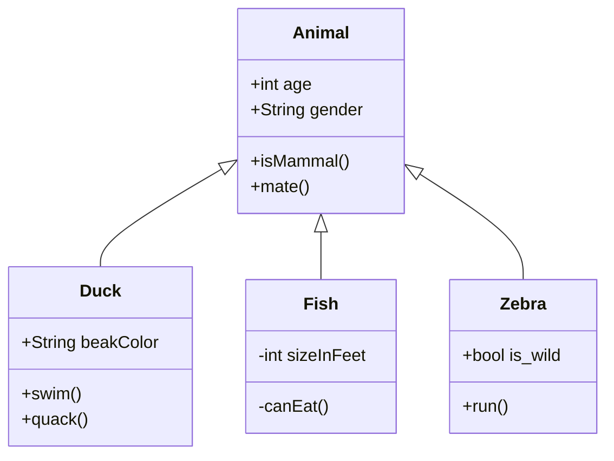

<br/>

<br/>

<br/>

<!--MERMAID {width:100}-->

<!--MCONTENT {content: "classDiagram<br/>\nAnimal <|-- Duck<br/>\nAnimal <|-- Fish<br/>\nAnimal <|-- Zebra<br/>\nAnimal : +int age<br/>\nAnimal : +String gender<br/>\nAnimal: +isMammal()<br/>\nAnimal: +mate()<br/>\nclass Duck{<br/>\n+String beakColor<br/>\n+swim()<br/>\n+quack()<br/>\n}<br/>\nclass Fish{<br/>\n\\-int sizeInFeet<br/>\n\\-canEat()<br/>\n}<br/>\nclass Zebra{<br/>\n+bool is\\_wild<br/>\n+run()<br/>\n}<br/>"} --->

<br/>

<br/>

<br/>

<br/>

This is an event loop in the code base
<!-- NOTE-swimm-snippet: the lines below link your snippet to Swimm -->
### 📄 game.py
```python
69         
70         for event in pygame.event.get():
71             if event.type == pygame.QUIT:
72                 running = False
73             elif event.type == pygame.KEYDOWN:
74                 if event.key == pygame.K_LEFT:
75                     player_x_change = -player_speed
76                 elif event.key == pygame.K_RIGHT:
77                     player_x_change = player_speed
78                 elif event.key == pygame.K_UP:
79                     player_y_change = -player_speed
80                 elif event.key == pygame.K_DOWN:
81                     player_y_change = player_speed
```

<br/>

<br/>

<br/>

This file was generated by Swimm. [Click here to view it in the app](https://app.swimm.io/repos/Z2l0aHViJTNBJTNBY2hhdEdQVEdhbWUlM0ElM0F3aGl0ZTEwNQ==/docs/jg94z).
