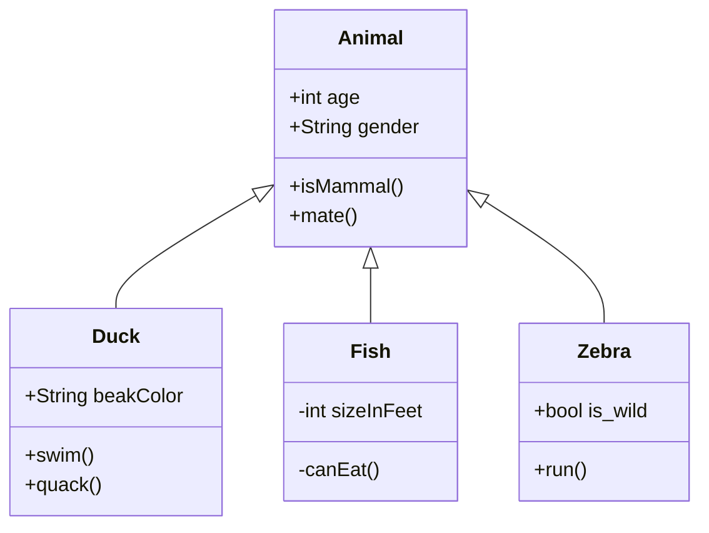

<br/>

<br/>

[<--VIDEO-->](https://youtu.be/ng438SIXyW4)

<br/>

<br/>

<br/>

<!--MERMAID {width:100}-->

<!--MCONTENT {content: "classDiagram<br/>\nAnimal <|-- Duck<br/>\nAnimal <|-- Fish<br/>\nAnimal <|-- Zebra<br/>\nAnimal : +int age<br/>\nAnimal : +String gender<br/>\nAnimal: +isMammal()<br/>\nAnimal: +mate()<br/>\nclass Duck{<br/>\n+String beakColor<br/>\n+swim()<br/>\n+quack()<br/>\n}<br/>\nclass Fish{<br/>\n\\-int sizeInFeet<br/>\n\\-canEat()<br/>\n}<br/>\nclass Zebra{<br/>\n+bool is\\_wild<br/>\n+run()<br/>\n}<br/>"} --->

<br/>

<br/>

<br/>

<br/>


<!-- NOTE-swimm-snippet: the lines below link your snippet to Swimm -->
### 📄 game.py
```python
97         elif player_y < 0:
98             player_y = screen_height
99     
100        # Clear the screen
101        screen.fill((0, 0, 0))
102        # Draw the player spaceship
103        screen.blit(player_image, (player_x, player_y))
104    
105        # Move the gem
106        gem_x += gem_x_change
107        gem_y += gem_y_change
108        # Check if the gem is outside the screen boundaries and reverse its direction
109        if gem_x > screen_width or gem_x < 0:
110            gem_x_change = -gem_x_change
111        if gem_y > screen_height or gem_y < 0:
112            gem_y_change = -gem_y_change
113    
114    
115        # Move the asteroid and check for collisions with the walls
116        asteroid = asteroids[0]
117        # Check if the asteroid is outside the screen boundaries and reverse its direction
118        if asteroid[1] > screen_width or asteroid[1] < 0:
```

<br/>

This file was generated by Swimm. [Click here to view it in the app](https://app.swimm.io/repos/Z2l0aHViJTNBJTNBY2hhdEdQVEdhbWUlM0ElM0F3aGl0ZTEwNQ==/docs/514qp).
